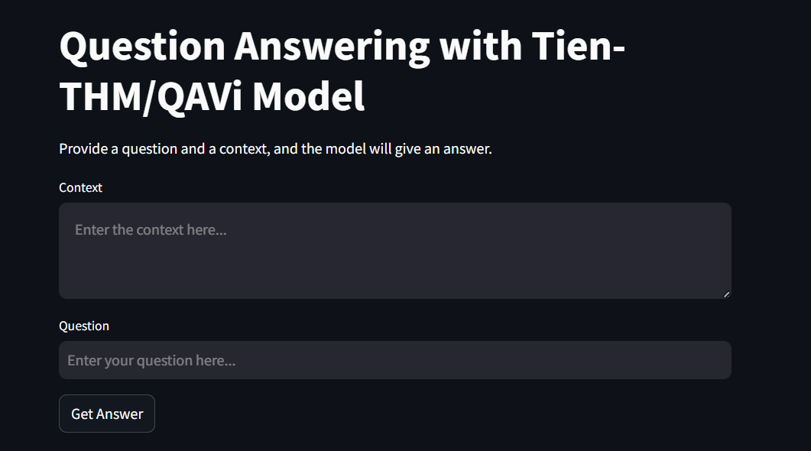

# Question-answering
Fine-tuning LLMs for answering questions in Vietnamese

# Installation
1. Clone the repository:
```bash
git clone https://github.com/Tohoangminhtien/Question-answering.git
```
2. Navigate to the project directory:
```bash
cd Question-answering
```
3. Install dependencies:
```bash
pip install -r requirements.txt
```
4. Run streamlit:
```bash
streamlit run GUI.py
```

5. Result:
